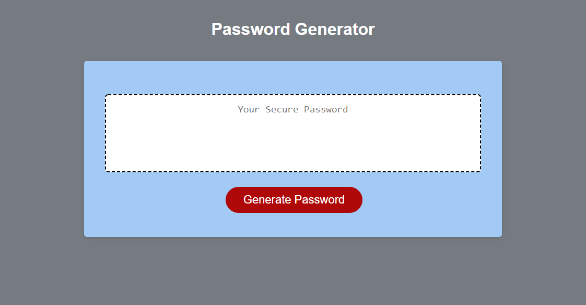

# PASSWORD GENERATOR

## 1. Description
Application where the user can create a random password based on criteria they select. This project was built using HTML, CSS and JavaScript

DEPLOYMENT:
 [DIRECT LINK](https://cbushehry.github.io/password-generator/) | [GITHUB REPOSITORY](https://github.com/cbushehry/password-generator)

## 2. Features
 * Generate a random password between 8 and 128 characters
 * Criteria includes lowercase, uppercase, numeric, or special characters

 

## 3. Tech Stack
 * HTML
 * CSS 
 * JavaScript

## 4. Credits / Contact
This application was made by Cameron Bushehry

Contact Me: c.bushehry@gmail.com
